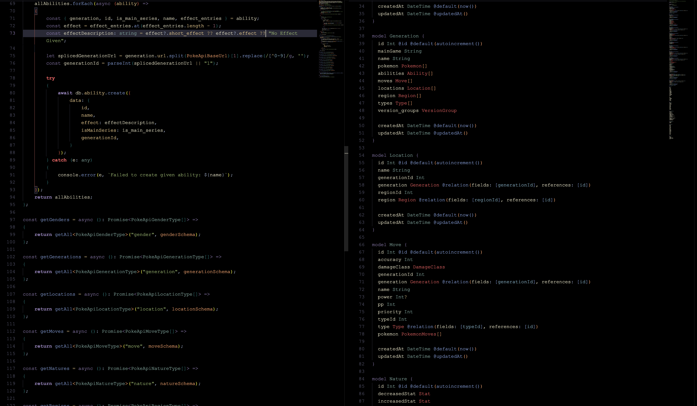

# pokemon-showdown

# Server

- [Prisma used to connect to MySQL backend database](https://www.prisma.io/docs)
- [Express.js used as the backend API layer](https://expressjs.com/)
- [Zod used as a Validation Library](https://zod.dev/)
- [JsonWebToken used as an Authentication layer](https://jwt.io/)

# Client (in progress)

- [Redux Toolkit as the state manager](https://redux-toolkit.js.org/)
- [React.js (Vite) as the Frontend Framework](https://react.dev/)
- [TailwindCSS as the styling library](https://tailwindcss.com/)
- [shadcnui (and radix-ui) as the "component" library](https://ui.shadcn.com/)
- [Framer Motion for adding more interactivity](https://www.framer.com/motion/)
