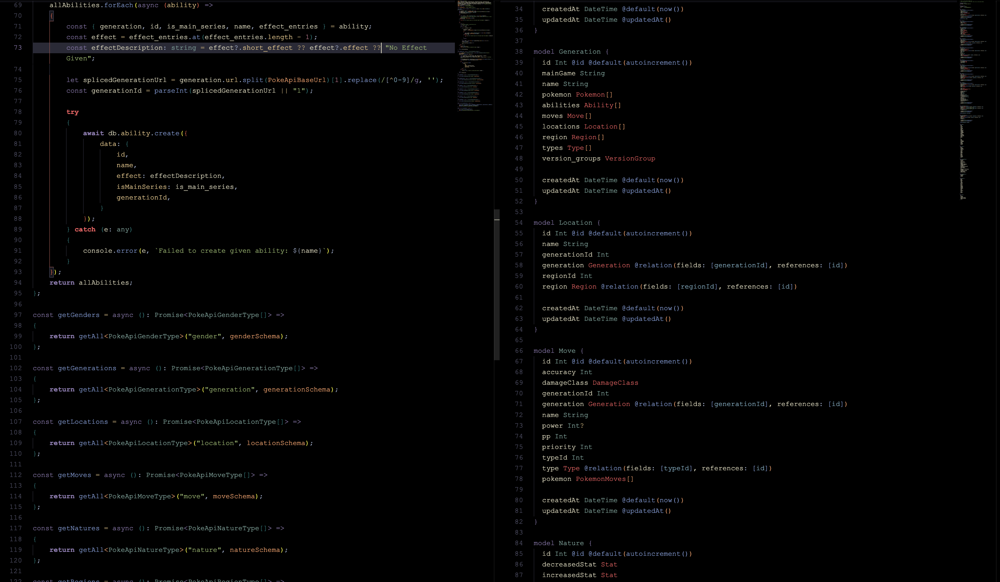

# pokemon-showdown

# Server

- Prisma used to connect to MySQL backend
- Express.js Used as the backend API layer
- Zod used as a Validation Library
- JsonWebToken used as an Authentication layer

# Client (in progress)

- Redux as the state manager
- React.js (Vite) as the Frontend Framework
- TailwindCSS as the styling library
- shadcnui as the "component" library
